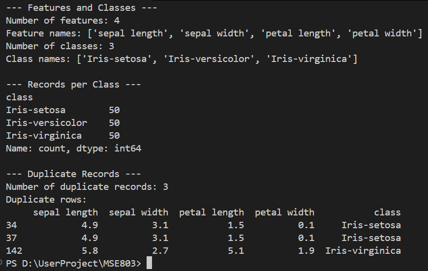

# Week 1 - Activity 2: IRIS Dataset Exploration and Analysis

## 1. Overview & Understanding
The Iris dataset is a classic benchmark dataset in machine learning and statistics, introduced by Sir Ronald Fisher in 1936. It consists of measurements for three species of Iris flowers: *Iris setosa*, *Iris versicolor*, and *Iris virginica*. 

The objective of this activity :
- Identifying the available features (inputs) and target classes (labels).
- Checking the sample distribution across target classes.
- Detecting duplicate records within the dataset.

---

## 2. Methodology & Steps Followed

1. **Environment Setup:** Configured a Python workspace in Visual Studio Code and installed the necessary libraries (`ucimlrepo` and `pandas`).
2. **Data Acquisition:** Used the `ucimlrepo` package to programmatically fetch the dataset directly from the UCI Machine Learning Repository using dataset ID `53`.
3. **Data Assembly:** Extracted feature values (`X`) and target labels (`y`), then combined them into a unified Pandas DataFrame (`df`) for holistic record analysis.
4. **Exploratory Data Analysis (EDA):**
   - Determined the feature count and list of feature names using `.shape[1]` and `.columns`.
   - Identified the unique target classes and total class count using `.nunique()` and `.unique()`.
   - Computed the class balance using `.value_counts()`.
   - Identified duplicate rows using Pandas `.duplicated()` method.

---
## 3. Key Findings

### Features and Classes
- **Number of Features:** 4
- **Feature Names:**
  - sepal length
  - sepal width
  - petal length
  - petal width
- **Number of Classes:** 3
- **Class Names:** Iris-setosa, Iris-versicolor, Iris-virginica

### Class Distribution
The dataset is perfectly balanced across all three flower species:

- **Iris-setosa:** 50 records
- **Iris-versicolor:** 50 records
- **Iris-virginica:** 50 records
- **Total Records:** 150 instances

### Duplicate Records
- **Number of Duplicate Records Found:** 3
- **Details of Identified Duplicates:**
  - Index 34: `[4.9, 3.1, 1.5, 0.1, 'Iris-setosa']` (duplicate of row 9)
  - Index 37: `[4.9, 3.1, 1.5, 0.1, 'Iris-setosa']` (triplicate of row 9)
  - Index 142: `[5.8, 2.7, 5.1, 1.9, 'Iris-virginica']` (duplicate of row 101)

## 4. Conclusion
The dataset containins 150 total records with 4 numerical features representing physical measurements of iris flowers. There are 3 duplicate entries present in the raw UCI dataset that represent identical measurement records.

